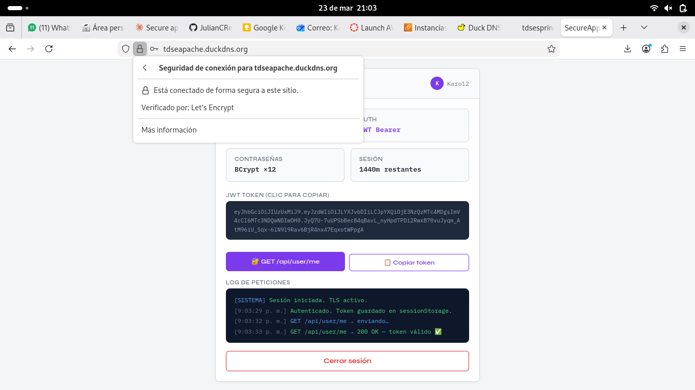
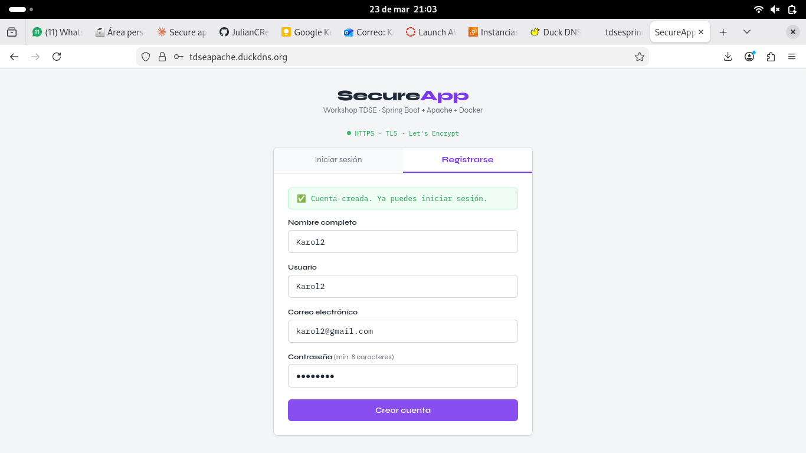
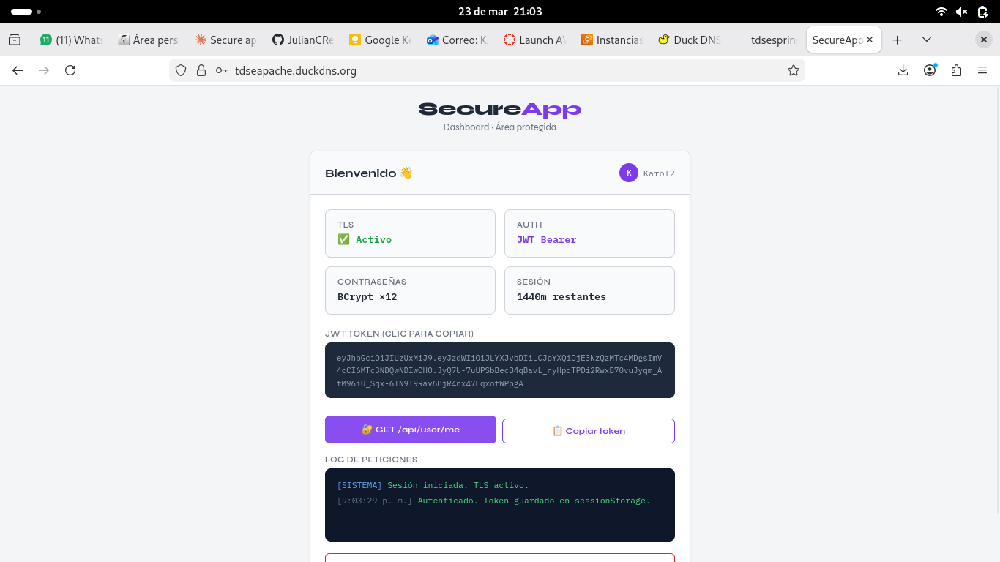
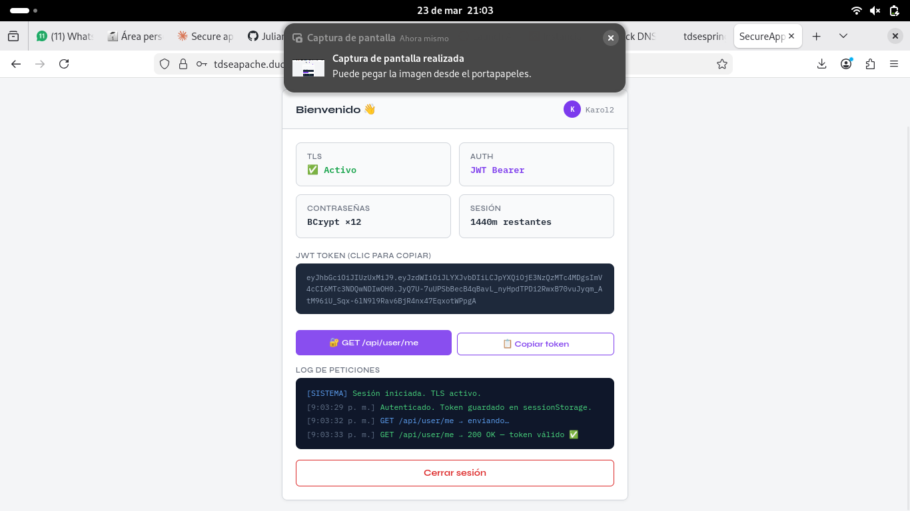
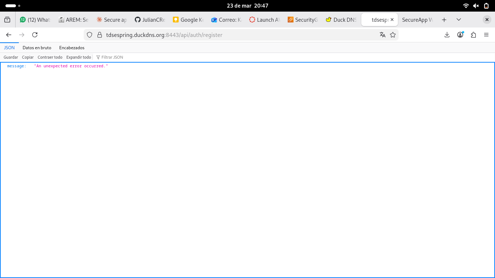

#  Secure App Workshop
**Enterprise Architecture Workshop — TDSE**

Aplicación web segura con autenticación JWT desplegada en AWS EC2 usando Docker. Apache actúa como servidor de archivos estáticos con TLS (Let's Encrypt), Spring Boot maneja la API REST y PostgreSQL almacena contraseñas hasheadas con BCrypt.

---

##  Arquitectura

```
Browser
   │
   ├── HTTPS :443 ──► EC2 #1: Apache
   │                    └── Sirve index.html (HTML + JS + CSS)
   │
   └── HTTPS :8443 ──► EC2 #2: Spring Boot (Docker)
                          ├── /api/auth/register  (BCrypt)
                          ├── /api/auth/login     (JWT)
                          ├── /api/user/me        (protegido)
                          └── PostgreSQL          (password_hash)
```

---

##  Evidencias

### Página de login con candado HTTPS — Apache (Let's Encrypt)



---

### Registro de usuario



---

### Login exitoso y JWT en el dashboard



---

### Endpoint protegido GET /api/user/me → 200 OK



---

### Certificado Let's Encrypt en Spring (puerto 8443)



---

##  Estructura del Proyecto

```
secure-app-workshop/
├── Dockerfile                              # Multi-stage build (Java 21)
├── docker-compose.yml                      # Dev local
├── docker-compose.prod.yml                 # Producción AWS
├── pom.xml
├── .env.example                            # Plantilla de variables
├── frontend/
│   └── index.html                          # Cliente async HTML+JS
└── src/main/
    ├── java/com/workshop/app/
    │   ├── config/
    │   │   ├── SecurityConfig.java         # Spring Security + JWT + CORS
    │   │   └── GlobalExceptionHandler.java
    │   ├── controller/
    │   │   ├── AuthController.java         # POST /api/auth/register  /login
    │   │   └── UserController.java         # GET  /api/user/me
    │   ├── dto/
    │   │   ├── request/LoginRequest.java
    │   │   ├── request/RegisterRequest.java
    │   │   └── response/AuthResponse.java
    │   ├── model/User.java
    │   ├── repository/UserRepository.java
    │   ├── security/
    │   │   ├── JwtUtils.java
    │   │   ├── JwtAuthFilter.java
    │   │   └── UserDetailsServiceImpl.java
    │   └── service/AuthService.java
    └── resources/
        ├── application.properties
        └── apache/
            ├── httpd.local.conf
            └── httpd.prod.conf
```

---

##  Características de Seguridad

### BCrypt (cost factor 12)
Las contraseñas **nunca** se guardan en texto plano. Se hashean con BCrypt antes de persistir en la base de datos:
```java
.password(passwordEncoder.encode(req.getPassword()))  // BCrypt hash
```

### JWT Stateless
- Firmado con HMAC-SHA256
- Expira en 24 horas
- Sin sesión en el servidor → escalable horizontalmente
- Validado en cada request por `JwtAuthFilter`

### TLS con Let's Encrypt
- EC2 Apache: certificado en puerto 443
- EC2 Spring: certificado en puerto 8443
- Protocolos: TLS 1.2 y 1.3 únicamente

### Cabeceras HTTP de Seguridad
```
Strict-Transport-Security: max-age=63072000; includeSubDomains; preload
X-Frame-Options: DENY
X-Content-Type-Options: nosniff
X-XSS-Protection: 1; mode=block
Referrer-Policy: strict-origin-when-cross-origin
```

---

##  Despliegue Local (sin Docker)

```bash
git clone https://github.com/Karol2905/-Secure-Application-Design.git
cd -Secure-Application-Design
mvn spring-boot:run
# API en http://localhost:8080
# H2 Console: http://localhost:8080/h2-console
```

---

##  Despliegue en AWS EC2

### Infraestructura

| Servidor | Dominio | Puerto | Tecnología |
|----------|---------|--------|------------|
| Apache | tdseapache.duckdns.org | 443 | httpd + Let's Encrypt |
| Spring | tdsespring.duckdns.org | 8443 | Docker + Let's Encrypt |

### Security Groups

**EC2 Apache:**

| Puerto | Protocolo | Origen |
|--------|-----------|--------|
| 22 | TCP | Mi IP |
| 80 | TCP | 0.0.0.0/0 |
| 443 | TCP | 0.0.0.0/0 |

**EC2 Spring:**

| Puerto | Protocolo | Origen |
|--------|-----------|--------|
| 22 | TCP | Mi IP |
| 8443 | TCP | 0.0.0.0/0 |

### Pasos de despliegue

```bash
# 1. Conectar a la EC2
ssh -i "clave.pem" ec2-user@tdsespring.duckdns.org

# 2. Instalar Docker
sudo dnf install -y docker git
sudo systemctl enable --now docker
sudo usermod -aG docker ec2-user

# 3. Clonar el repo
git clone https://github.com/Karol2905/-Secure-Application-Design.git
cd -- -Secure-Application-Design

# 4. Configurar variables
cp .env.example .env
nano .env

# 5. Obtener certificado TLS
sudo certbot certonly --standalone -d tdsespring.duckdns.org

# 6. Levantar contenedores
docker compose up --build -d
```

---

##  API Endpoints

| Método | Endpoint | Auth | Descripción |
|--------|----------|------|-------------|
| POST | `/api/auth/register` | No | Registrar usuario (BCrypt hash) |
| POST | `/api/auth/login` | No | Login → JWT token |
| GET | `/api/user/me` | JWT | Verificar sesión activa |

### Ejemplos

```bash
# Registro
curl -k -X POST https://tdsespring.duckdns.org:8443/api/auth/register \
  -H "Content-Type: application/json" \
  -d '{"username":"karol","email":"karol@test.com","password":"pass1234","fullName":"Karol"}'

# Login
curl -k -X POST https://tdsespring.duckdns.org:8443/api/auth/login \
  -H "Content-Type: application/json" \
  -d '{"username":"karol","password":"pass1234"}'

# Endpoint protegido
curl -k https://tdsespring.duckdns.org:8443/api/user/me \
  -H "Authorization: Bearer eyJhbGci..."
```

---

